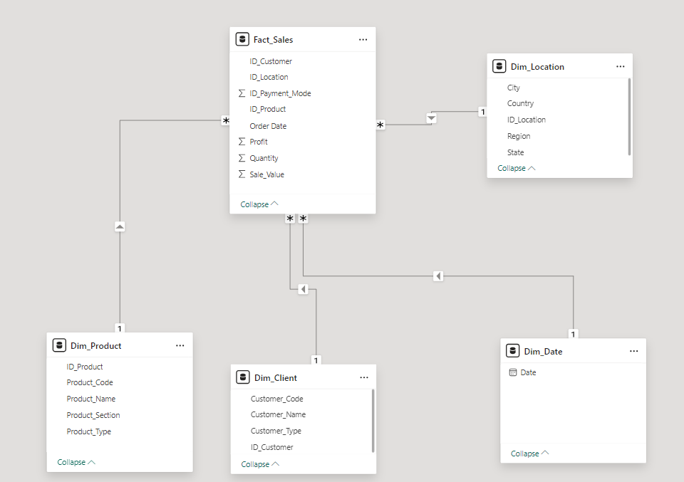
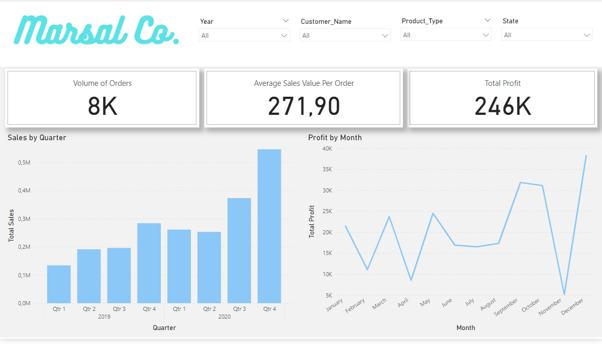
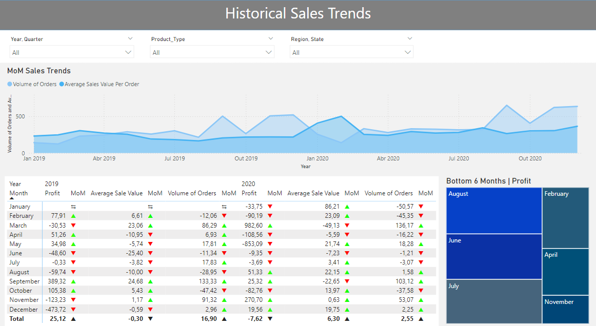

# Power BI Project: Sales Analysis of Marsal Co.

## Project Background and Overview

Marsal Co. (fictional company) is a US based versatile retail chain that sells a wide variety of products via website and mobile app. The company produces large amounts of data, regarding sales, that have been severely underutilized and can be leveraged by multiple teams inside the company, including Marketing, Sales and Operations to bring more revenue and better allocate company's resources.
This project thouroughly analyzes the data in order to uncover critical insights that will contribute to Marsal's commercial success.

Insights and recommendations will be provided in the following:
- Sales Trends Analysis: A comprehensive review of historical trends from 2019 to 2020, focusing on profit, sales, and quantity sold to identify growth patterns and potential areas for improvement.
- Regional Comparison: An in-depth comparison of key business metrics across various cities, states, and regions in the USA, providing insights into the geographical distribution of sales performance.
- Product-Level Analysis: A detailed examination of Marsal's diverse product portfolio to assess its impact on overall sales and profitability, identifying top-performing and underperforming products.
- Customer-Level Analysis: An exploration of customer behavior and loyalty to understand their influence on sales, helping to uncover trends in client retention and purchasing habits.

The source of the data can be found here. (inserir link)

An interactive Power BI dashboard can be downloaded here. (inserir projeto)

A file with DAX measures implemented can be found here. (inserir bloco de notas com as measures)

## Data Structure Overview

Marsal's data model consists of four dimension tables (Date, Product, Client and Location) and one fact table (Sales) with a total row count of 8233.

Power Query was used to finalize the data model by generating primary keys, as well as performing tasks such as verifying duplicates, identifying missing values, and addressing inconsistencies.

## Executive Summary

## Insights Deep Dive

### Sales Trends

- Marsal's sales experienced a local peak in December 2019, 522 orders, followed by a significant decline during the early months of COVID-19. After March 2020, sales began to recover steadily, reaching a new peak in December 2020, 637 orders. This trend aligns with the global drop in consumption at the onset of the pandemic, followed by continuous growth as the initial impact of COVID subsided.
- In both years, the months surrounding the holiday season (November and December) show a clear increase in order volume, with growth of 91.32% and 2.96% in 2019, and 53.07% and 2.25% in 2020. This aligns with expected seasonal fluctuations. However, during the same period in 2019, there was a significant decline in profit, dropping by -123.23% in November and -473.72% in December.
- The average sales value showed steady growth leading up to COVID, peaking at $502.28 in February 2020. Afterward, it declined and did not fully recover by the end of 2020.
- The most profitable season was summer, with July, August, and September seeing profit increases of 40.18% in 2019 and 14.16% in 2020. This can largely be attributed to strong performance in the Accessories category, which saw significant growth during this quarter, with 160.45% in 2019 and 57.42% in 2020.

## Recommendations

