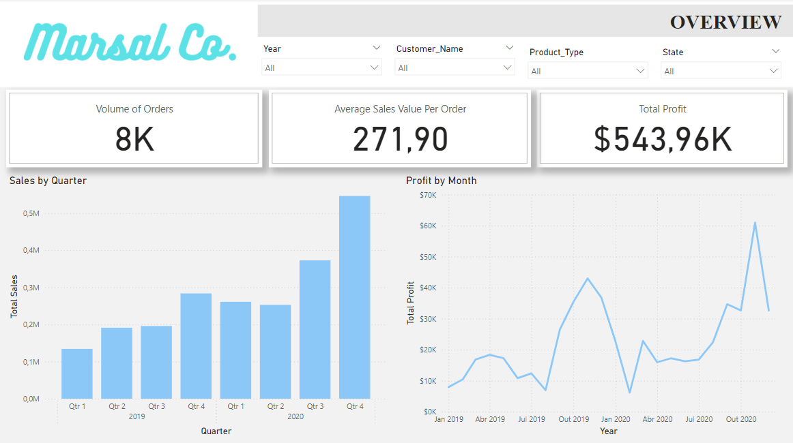
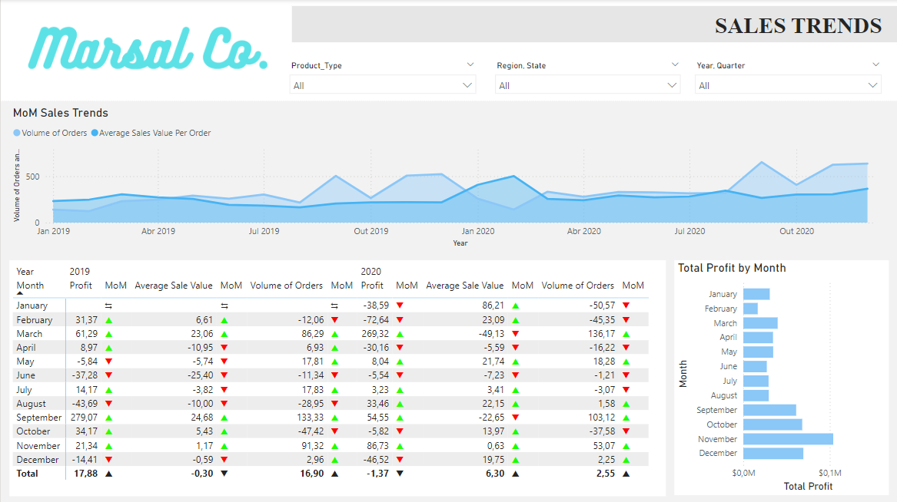
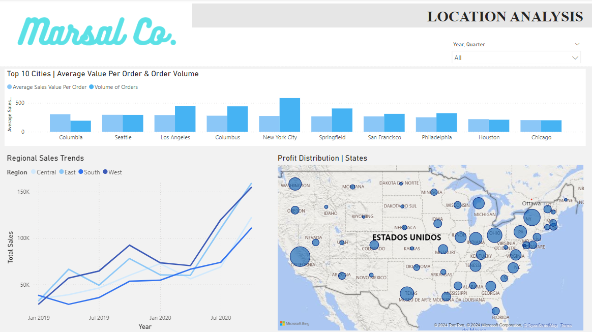
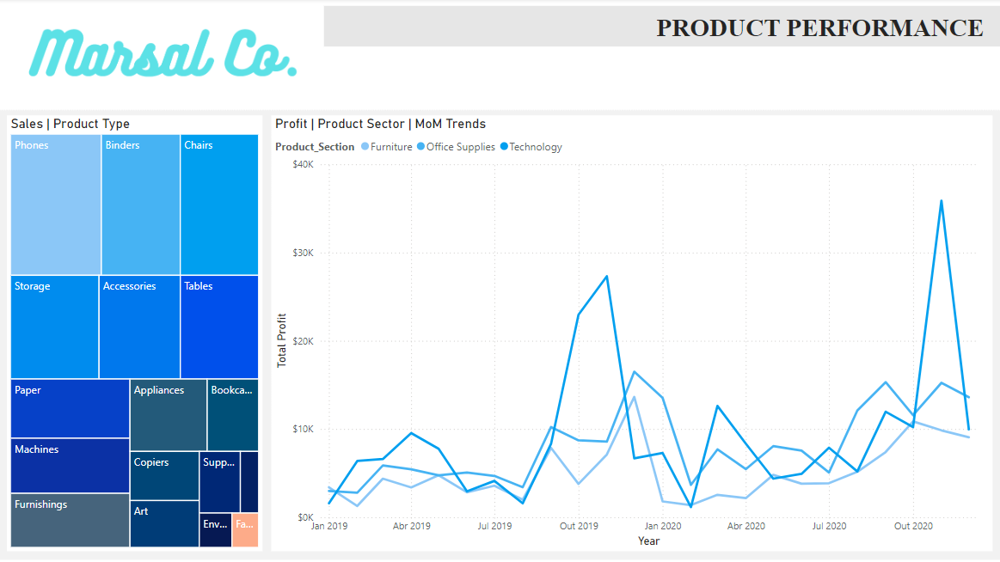
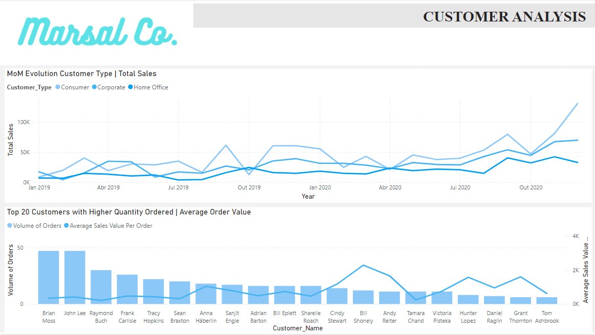

# Power BI Project: Sales Analysis of Marsal Co.

## Project Background and Overview

Marsal Co. (fictional company) is a US based versatile retail chain that sells a wide variety of products via website and mobile app. The company produces large amounts of data, regarding sales, that have been severely underutilized and can be leveraged by multiple teams inside the company, including Marketing, Sales and Operations to bring more revenue and better allocate company's resources.
This project thouroughly analyzes the data in order to uncover critical insights that will contribute to Marsal's commercial success.

Insights and recommendations will be provided in the following:
- Sales Trends Analysis: A comprehensive review of historical trends from 2019 to 2020, focusing on profit, sales, and quantity sold to identify growth patterns and potential areas for improvement.
- Regional Comparison: An in-depth comparison of key business metrics across various cities, states, and regions in the USA, providing insights into the geographical distribution of sales performance.
- Product-Level Analysis: A detailed examination of Marsal's diverse product portfolio to assess its impact on overall sales and profitability, identifying top-performing and underperforming products.
- Customer-Level Analysis: An exploration of customer behavior and loyalty to understand their influence on sales, helping to uncover trends in client retention and purchasing habits.

The source of the data can be found [here](https://www.kaggle.com/datasets/monisamir/online-super-store-sales-analysis).

An interactive Power BI dashboard can be downloaded [here](https://github.com/davidfortunato/davidfortunato_portfolio/raw/main/Company%20X%20sales%20performance.pbix). 

## Data Structure Overview

Marsal's data model consists of four dimension tables (Date, Product, Client and Location) and one fact table (Sales) with a total row count of 8233. KPIs (Key Performance Indicators) have shown a month-over-month increase: a 300% increase in profit and in sales between January 2019 and December 2020. This growth can be highly atributed to post-COVID consuming, but further analysis into each of the dimensions analysed will be able to share some more insights on the root causes.

Below is the Overview page of the Power BI Dashboard and more examples are included throughout the report. For the full Power BI report download here. (incluir report)

Power Query was used to finalize the data model by generating primary keys, as well as performing tasks such as verifying duplicates, identifying missing values, and addressing inconsistencies.

## Executive Summary

### Overview of Findings

Marsal's sales remained remarkably consistent between 2019 and 2020, despite the challenges posed by the COVID-19 pandemic. Although there was a brief period of decline, the impact on sales was minimal, and the company quickly rebounded, surpassing pre-COVID sales levels. This report highlights key findings, presents a thorough analysis of KPIs, and offers strategic recommendations for Marsal Co.'s executive team. The insights will help guide future decision-making to ensure sustained growth and adaptability in a changing market.

Below is the Overview page of the Power BI Dashboard and more examples are included throughout the report. For the full Power BI report download [here](https://github.com/davidfortunato/davidfortunato_portfolio/raw/main/Company%20X%20sales%20performance.pbix). 

## Insights Deep Dive

### Sales Trends

- Marsal's sales experienced a local peak in December 2019, 522 orders, followed by a significant decline during the early months of COVID-19. After March 2020, sales began to recover steadily, reaching a new peak in December 2020, 637 orders. This trend aligns with the global drop in consumption at the onset of the pandemic, followed by continuous growth as the initial impact of COVID subsided.
- In both years, the months surrounding the holiday season (November and December) show a clear increase in order volume, with growth of 91.32% and 2.96% in 2019, and 53.07% and 2.25% in 2020. This aligns with expected seasonal fluctuations. However, during the same period in 2019, there was a significant decline in profit, dropping by -123.23% in November and -473.72% in December.
- The average sales value showed steady growth leading up to COVID, peaking at $502.28 in February 2020. Afterward, it declined and did not fully recover by the end of 2020.
- The most profitable season was summer, with July, August, and September seeing profit increases of 40.18% in 2019 and 14.16% in 2020. This can largely be attributed to strong performance in the Accessories category, which saw significant growth during this quarter, with 160.45% in 2019 and 57.42% in 2020.

Below is the Sales Trends page of the Power BI Dashboard and more examples are included throughout the report. For the full Power BI report download [here](https://github.com/davidfortunato/davidfortunato_portfolio/raw/main/Company%20X%20sales%20performance.pbix). 

### Location Analysis

- Two states stand out as pillars of Marsal’s profitability: California and New York. California contributed $50125, and New York added $43504, making up 38% of the total profit. This dominance is no surprise, given their status as two of the wealthiest and most populous states in the U.S. Together, they underscore the importance of targeting high-demand markets for Marsal’s success.
- Columbia, though handling an average volume of orders, sets itself apart with the highest Average Order Value (AOV) in the country. This indicates that customers in Columbia tend to make larger, more profitable purchases, a trend worth capitalizing on for future growth.
- 2020 was a year of volatility, but despite the early struggles, all regions of Marsal’s operations stayed above their pre-COVID baseline. The most striking turnaround came in the final two quarters, where regions not only recovered but surged. The East region, in particular, exemplified this resurgence, jumping by 54% from $56,177 to $122,036 by year’s end. This recovery highlights the resilience of the business during a challenging period and shows how strategic adjustments led to a stronger-than-expected close to the year.
- The central states, particularly Wyoming, stand out as the lowest contributors to Marsal’s profit, with Wyoming generating only $100 in total profit. In stark contrast, Washington has a much higher profit of $25,801.

Below is the Location Analysis page of the Power BI Dashboard and more examples are included throughout the report. For the full Power BI report download [here](https://github.com/davidfortunato/davidfortunato_portfolio/raw/main/Company%20X%20sales%20performance.pbix). 

### Product Performance

- Throughout the analysis, Technology consistently emerged as the most profitable sector, leading in nine months across both years. Notably, in November of both 2019 and 2020, the Technology sector experienced a significant spike in profit, 27320$ and 35886$ respectivelly, outpacing all other sectors. This surge likely corresponds with major shopping events like Black Friday and Cyber Monday, where demand for tech products typically skyrockets, contributing to the impressive profitability during those periods.
- Office Supplies and Furniture showed resilience to seasonal fluctuations, maintaining consistent profit growth throughout the months. Over the two-year period, Office Supplies saw a remarkable growth of 358%, while Furniture followed closely with a 267% increase. Their steady performance highlights a stable demand, unaffected by typical market seasonality.
- In contrast, the surge in Technology sales can largely be attributed to Phones, which stand out as the only technology product in the top five most sold items. With total sales reaching $280K over the two years, Phones significantly contributed to the sector’s dominance in overall sales.

Below is the Product Performance page of the Power BI Dashboard and more examples are included throughout the report. For the full Power BI report download [here](https://github.com/davidfortunato/davidfortunato_portfolio/raw/main/Company%20X%20sales%20performance.pbix). 

### Customer Analysis

- Personal Customers (or Consumers) emerged as the highest spending group, reaching a peak of $130,426 in their best month, December 2020.
- Across all customer segments, there were no significant spikes, either positive or negative, over the two-year period, indicating steady performance for Personal Customers, Corporate, and Home Office clients alike. Despite external factors, their purchasing behavior remained relatively stable throughout the timeline.
- Customers with the highest order volume surprisingly had some of the lowest Average Order Values (AOV), ranging between $300 and $500. In contrast, customers with the lowest order volume had significantly higher AOVs, averaging around $2,000. This suggests that high-volume customers tend to make frequent, smaller purchases, while lower-volume customers may place fewer but more substantial orders.

Below is the Customer Analysis page of the Power BI Dashboard and more examples are included throughout the report. For the full Power BI report download [here](https://github.com/davidfortunato/davidfortunato_portfolio/raw/main/Company%20X%20sales%20performance.pbix). 

## Recommendations

- While the current customer insights provide valuable information, a deeper analysis through customer segmentation is crucial to fully understand purchasing patterns. Collaborating with the Marketing team will be key to gathering more detailed data—such as implementing customer loyalty programs or cards—and refining strategies. Together, these efforts can drive more targeted marketing campaigns aimed at increasing sales, profitability, and average order value (AOV). By better understanding customer behaviors and preferences, Marsal can create tailored promotions that resonate with key segments, leading to more effective campaigns and higher returns. These strategies employed by other medium and large B2C companies have a high-ROI and can enhance competitiveness. This approach could potentially increase revenue by as much as 4.9 times the initial investment, allowing Marsal to capitalize on market opportunities and drive sustainable growth. 
- Operations and marketing teams should conduct a comprehensive geographical analysis to understand why sales in the more interior regions of the USA lag behind those in major urban centers like New York and Los Angeles. While it’s expected that these cities, as significant economic hubs, offer greater sales potential, the disparity highlights untapped markets with considerable opportunities. Identifying the factors contributing to lower sales in these areas could unveil strategies for growth and market penetration. With these strategy, Marsal can aim to take a higher marketshare in these locations and make this regions generate at least 25% of their sales (in December 2020 was near 22%).
- Given the substantial fluctuations in sales during the holiday season—particularly around Christmas and Black Friday—the Marketing team should strategically focus their campaigns during these key periods. Implementing targeted discounts and enhancing online advertising efforts can not only drive overall sales but also significantly boost Average Order Value (AOV), capitalizing on the existing purchasing trends typical of these festive times (from October to November 2020 there was an increase of 87% in revenue).
- To enhance overall performance, further research into the distribution of sales between online and in-store channels is essential for Marsal. A comprehensive project should be initiated involving cross-disciplinary teams, including Marketing, Data Analytics, and executive leadership. The initial analysis revealed intriguing insights, particularly during the months surrounding the onset of COVID-19. Marsal should focus on replicating the sales success experienced during that period to boost online sales and overall revenue. This strategy already implemented by many of Marsal's competitors alrady generated a 100% increase in e-commerce sales in the last 4 years for one of their biggest competitors.

